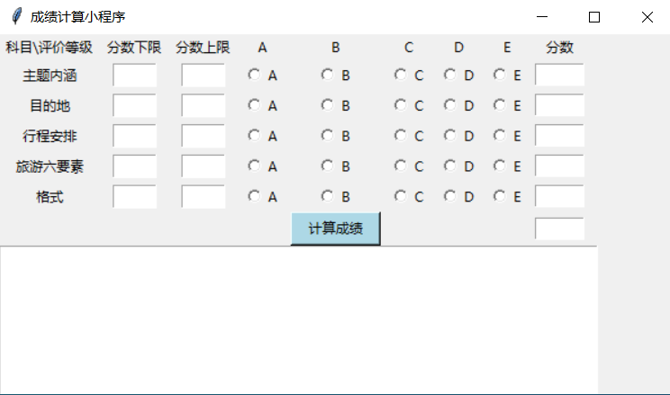

# Score Tools
## Introduction

This repository includes tools for auto-scoring.

这是一个用于自动积分的小程序，动机源自为大量作品打分。直接为作品整体打分会引入极大的随机性和主观性，因此为使打分工作更具逻辑性和稳定性，将整个打分工作进行模块化。对每个模块打分，同时为进一步减小模块打分的随机性和主观性，采用分级的形式，将每个模块的分数分为5级：A、B、C、D、E，依次表示优秀到不及格。每个模块只能选定一个等级，最后点击“计算成绩”按钮即可直接生成各个模块的分数和总分。

## How to use

